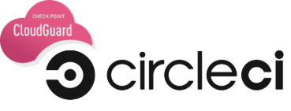
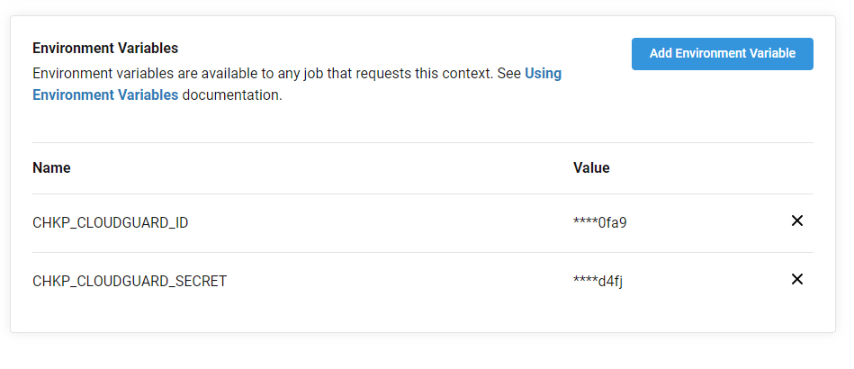

# Check Point Cloudguard ShiftLeft Orb for CircleCI

## Introduction

The Cloudguard ShiftLeft orb is a plugin for CircleCI that will scan source code, docker images, and Infrastructure as Code (IAC). ShiftLeft identifies both vulnerabilites and malware in source code & Docker images. You can also use ShiftLeft to 



<!---
[](https://circleci.com/gh/<organization>/<project-name>) [](https://circleci.com/orbs/registry/orb/<namespace>/<orb-name>) [](https://raw.githubusercontent.com/<organization>/<project-name>/master/LICENSE) [](https://discuss.circleci.com/c/ecosystem/orbs)
--->

## Prerequisites

- [Cloudguard CSPM Account](https://secure.dome9.com) (w/ API Key) 
- [CircleCI](https://circleci.com)

## Configuration

In order for ShiftLeft to run correctly, it requires that the API key & secret be set as Environment variables. Either create a new Context, or append the following to an existing context. For all of the following examples, the context will be "Cloudguard".

The two environment variables are:

CHKP_CLOUDGUARD_ID<br>
CHKP_CLOUDGUARD_SECRET<br>



From there, you can include the orb as a step within your job.

```shiftleft/shiftleft```

## Usage Examples

Example 1:<br>
An example with the default settings (code-scan):

```
version: 2.1

orbs:
  shiftleft: chkp-mibraun/shiftleft

workflows:
  set-context:
    jobs:
      - build:
          context: Cloudguard
jobs:
  build:
     machine:
       image: ubuntu-2004:202010-01
     steps:
       - checkout
       - shiftleft/shiftleft
```
Example 2:<br>
An example of image-scan with some parameters:

```
version: 2.1

orbs:
  shiftleft: chkp-mibraun/shiftleft@dev:alpha

workflows:
  set-context:
    jobs:
      - build:
          context: Cloudguard
jobs:
  build:
     machine:
       image: ubuntu-2004:202010-01
     steps:
       - checkout
       - run: |
           docker build -t test/test .
           docker save test/test  -o ./scantest.tar     
       - shiftleft/shiftleft:
           blade: image-scan
           docker-image: ./scantest.tar
```
Example 3:<br>
An example with all applicable parameters:
```
version: 2.1

orbs:
  shiftleft: chkp-mibraun/shiftleft@dev:alpha
orbs:
  shiftleft: chkp-mibraun/shiftleft
workflows:
  set-context:
    jobs:
      - build:
          context: Cloudguard
jobs:
  build:
     machine:
       image: ubuntu-2004:202010-01
     steps:
       - checkout
       - shiftleft/shiftleft:
           blade: iac-assessment
           scan-timeout: 900
           code-source: example/directory/
           exclude-path: example/exclude/path/
           json-output: true
           no-cache: true
           no-proxy: true
           no-blame: true
           ruleset-id: 201981
           severity-level: Critical
           severity-threshold: 100


```
## Parameters

| Parameter                                                  | Description                                                     | Default                                          |
| ---------------------------------------------------------- | --------------------------------------------------------------- | ------------------------------------------------ |
| `blade`                                                    | ShiftLeft Scan Type (code-scan, iac-assessment, image-scan)     | `code-scan`                                      |
| `scan-timeout`                                             | The length of time before a scan will timeout (in seconds)      | `600`                                            |
| `code-source`                                              | Source directory to scan source code or IAC                     | `.`                                              |
| `docker-image`                                             | Location of the image tar file                                  | `.`                                              |
| `exclude-path`                                             | Path to exclude from scan                                       | ` `                                              |
| `json-output`                                              | JSON Output (True or False)                                     | `false`                                          |
| `no-cache`                                                 | Do not take results from previous scan (True or False)          | `false`                                          |
| `no-proxy`                                                 | Do not use system proxy settings (True or False)                | `false`                                          |
| `no--blame`                                                | Do not use Git blame on scanned files  (True or False)          | `false`                                          |
| `ruleset-id`                                               | Check Point CSPM Ruleset ID (For iac-assessment)                | ` `                                              |
| `severity-level`                                           | Unknown (default), Low, Medium, High, Critical                  | `Unknown`                                        |
| `severity-threshold`                                       | Severity-level threshold (default: 0)                           | `0`                                              |
| ---------------------------------------------------------- | --------------------------------------------------------------- | ------------------------------------------------ |